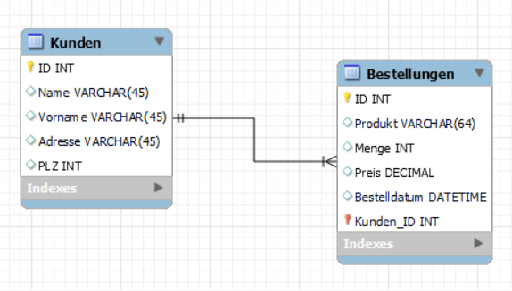

# Kunden-Bestellungen-API

## Beschreibung
Das Kunden-Bestellungen-API-Projekt ist eine Java Spring Boot-Anwendung, die als RESTful-API zur Verwaltung von Kunden und ihren Bestellungen dient. Es ermöglicht CRUD-Operationen für Kunden- und Bestellungs-Entitäten.

## Visualisierungen
- **Datenbankdiagramm:** 

## Validierungsregeln
- **Kunden:**
  - Der Name darf nicht leer sein.
- **Bestellungen:**
  - Produkt und Menge dürfen nicht leer sein.

## OpenAPI-Dokumentation
- *(Swagger hat NICHT funktioniert)*

## Autor
Celina Lutz

## Zusammenfassung
Das Kunden-Bestellungen-API-Projekt bietet eine robuste Lösung zur Verwaltung von Kunden und ihren Bestellungen über eine RESTful-Schnittstelle. Es gewährleistet die Integrität der Daten mit Validierungsregeln und sichert den Zugriff kontrolliert ab.
